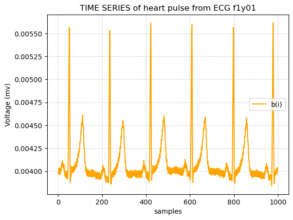
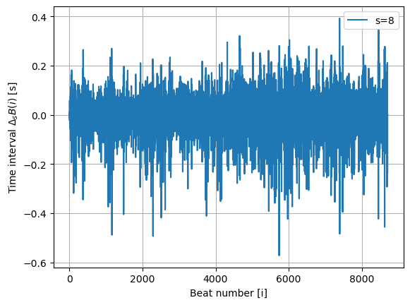
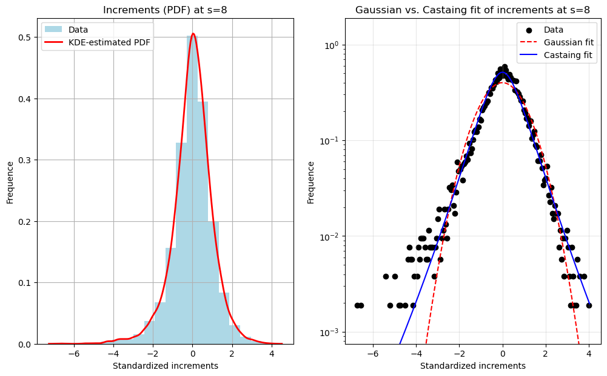
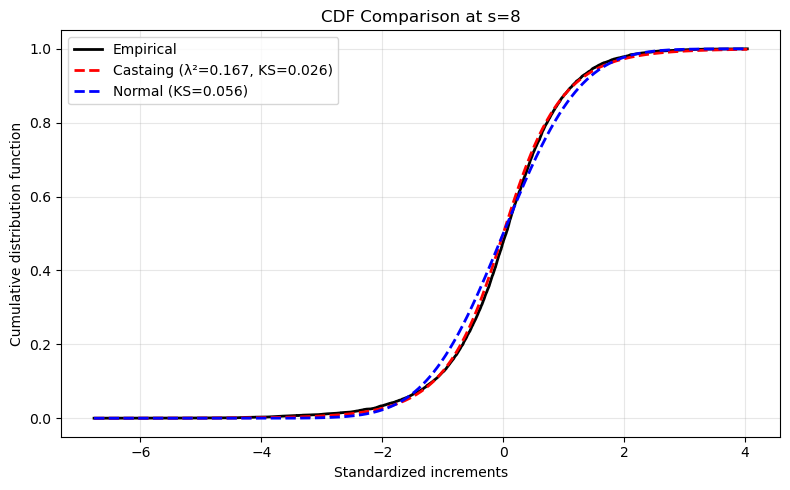
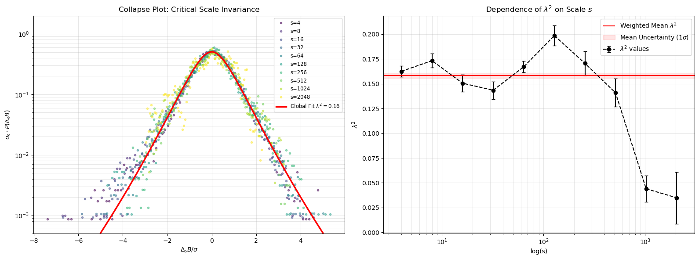

# Critical Scale Invariance in a Healthy Human Heart Rate

This work was done as the final project for the course "Laboratory of Computational Physics" (i.e., a Pyhton course for scientific data analysis) held by prof. M. Zanetti at University of Padova in academic year 2025/26.

It is an educational-purpose reproduction of Kiyono et al., *Phys. Rev. Lett.* **93**, 178103 (2004) on selected samples from the
[Fantasia](https://physionet.org/content/fantasia/1.0.0/) dataset (PhysioNet).

In a nutshell, we show that the distribution of a healthy human heart rate's temporal increments at scale $s$,
$\Delta_s B$, collapses onto a single non-Gaussian, 'fat-tailed' curve (comparable to a Castaing's probability density function)
and that the shape parameter $\lambda^2$ is scale-invariant.

**Group:** Luca Di Turi · Libero Pollini · Alessandro Turino · Mattia Ziglioli

---

## Contents

| File | Description |
|------|-------------|
| `main.ipynb`   | Full analysis notebook (data loading → fits → collapse → conclusions) |
| `utility.py`   | Helper functions: Castaing PDF/CDF, Kolmogorov-Smirnov and Anderson-Darling tests, normalization, plotting |

Everything is documented inside `main.ipynb`.

---

## Background
A short theoretical background on my (Libero Pollini) contribution to the work:

**Gaussian fit**

$$
\mathcal{N}(x;\mu,\sigma) = \frac{1}{\sqrt{2\pi\sigma^{2}}}\,
\exp\!\left(-\frac{(x-\mu)^{2}}{2\sigma^{2}}\right)
$$

**Castaing's PDF** (a log-normal mixture of Gaussians)

$$
\tilde{P}_{s}(x) = \int_{0}^{\infty}
P_{L}\!\left(\frac{x}{\sigma}\right)\frac{1}{\sigma}\,
G_{s,L}(\ln\sigma)\,d(\ln\sigma)
$$

with the log-normal kernel

$$
G_{s,L}(\ln\sigma) = \frac{1}{\sqrt{2\pi}\,\lambda}\,
\exp\!\left(-\frac{(\ln\sigma+\lambda^{2})^{2}}{2\lambda^{2}}\right)
$$

where $\lambda^{2}$ is the only free parameter.


**Kolmogorov–Smirnov test**

We compare the empirical CDF $F_n$ ($n$ samples) of the standardized increments to the Gaussian and Castaing CDFs ($F$) via

$$
D_n = \sup_x \, |F_n(x) - F(x)|
$$

Intuitively, the KS statistic is the maximum vertical gap between the two CDFs.

---

## Example plots
Some plots from the notebook to summarize the group work follow.

### ECG original signal

<p align="center">
  
</p>

<p align="center"><em>Example of an ECG trace. The corresponding "intervals between individual heartbeats" (bᵢ) are defined as distance between the R-peaks (the highest maxima in each period). </em></p>

### Interbeat intervals, or ΔₛB(i) or "increments", from the Fantasia dataset

<p align="center">
  
</p>

<p align="center"><em> Time series of the detrended fluctuations ("increments") ΔₛB(i) at a fixed scale s = 8, computed from the interbeat intervals bᵢ (cumulative sum B(m), local polynomial detrending, then sliding differences of window size s) </em></p>

### Gaussian vs. Castaing fit

<p align="center">
  
</p>

<p align="center"><em>Histogram and KDE of the increments ΔₛB(i) at s=8 (left), standardized, and comparison of the Gaussian and Castaing fits (right). The Gaussian clearly fails to reproduce the fat tails.</em></p>

### Kolmogorov-Smirnov test

<p align="center">
  
</p>

<p align="center"><em>Empirical CDF compared to the Gaussian and Castaing theoretical CDFs. The Castaing curve is visibly closer in the bulk, confirmed by the smaller KS statistic.</em></p>

### Scale invariance: PDF collapse and $\lambda^2$ vs $\log s$

<p align="center">
  
</p>

<p align="center"><em>Left: PDFs of the standardized increments collapse onto a single curve (Castaign's PDF). Right: fitted λ² (parameter in castaign's PDF) as a function of log s (s scale), consistent with a constant value.</em></p>

---

## How to run

```bash
pip install numpy pandas scipy matplotlib seaborn wfdb
wget -r -N -c -np https://physionet.org/files/fantasia/1.0.0/
jupyter notebook main.ipynb
```

`main.ipynb` expects `physionet.org/files/fantasia/1.0.0/subset/` in the
working directory, plus the annotation `.txt` files inside it.

---

## Contributions

As mentioned, this was a group project. My (Libero Pollini) individual contribution was mainly to implement the Gaussian and Castaing PDF/CDF direct comparison including the Kolmogorov-Smirnov test.

---

## Declaration of AI use

AI was used in some part of this work. With regard to my (L. Pollini) contribution, the use was limited to debugging and writing the code routine for the K.-S. test.

All code was reviewed, tested, and adapted by the authors;
all physical interpretation, model choices, and conclusions are our own.

---

## References

1. Peng, C-K. *et al.* Long-range anticorrelations and non-Gaussian behavior
   of the heartbeat. *Phys. Rev. Lett.* **70**, 1343 (1993).
2. Ivanov, P. C. *et al.* *Nature* **399**, 461 (1999).
3. [Heart rate — Wikipedia](https://en.wikipedia.org/wiki/Heart_rate)
4. Kiyono, K. *et al.* Critical scale invariance in a healthy human heart rate.
   *Phys. Rev. Lett.* **93**, 178103 (2004).
5. Lin, D. C., & Hughson, R. L. Modeling heart rate variability in healthy
   humans: a turbulence analogy. *Phys. Rev. Lett.* **86**, 1650 (2001).